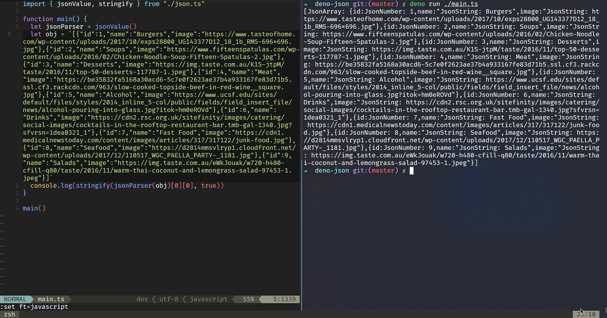

# djena

JSON parser in <https://deno.land> / TypeScript

## TODO

- [x] Basic building parser blocks
  - [x] `result`
  - [x] `zero`
  - [x] `item`
  - [x] `bind`
  - [x] `sat`
  - [x] `either`
  - [x] `sepBy`
  - [x] `many`
  - [ ] `EOF`
  - [ ] `oneOf`
  - [ ] `fmap`
  - [ ] `seq`
- [ ] Refactor
- [x] JSON
  - [x] Booleans
  - [x] String literals
    - [ ] Escape support
  - [x] Numbers
    - [ ] Floats
    - [ ] Negatives
  - [x] Arrays
  - [x] Objects
  - [x] null

## References

- <http://www.cs.nott.ac.uk/~pszgmh/monparsing.pdf>
- <https://www.youtube.com/watch?v=N9RUqGYuGfw>
- <https://beau.collins.pub/2020/parser-and-getting-complicated-with-types/>
- <https://www.sigmacomputing.com/blog/writing-a-parser-combinator-from-scratch-in-typescript/>
